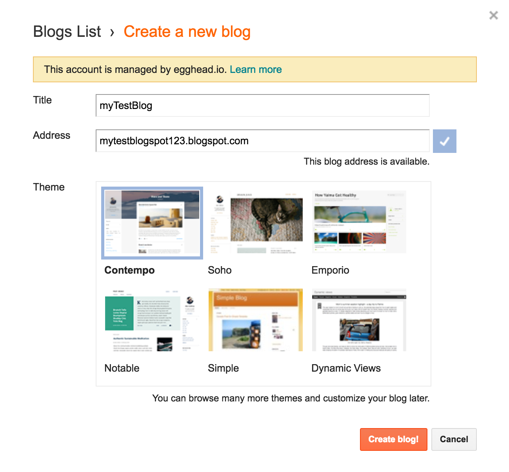
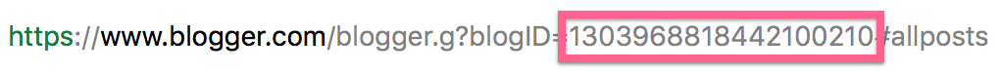
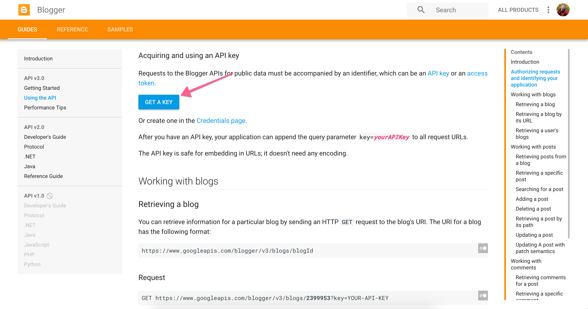
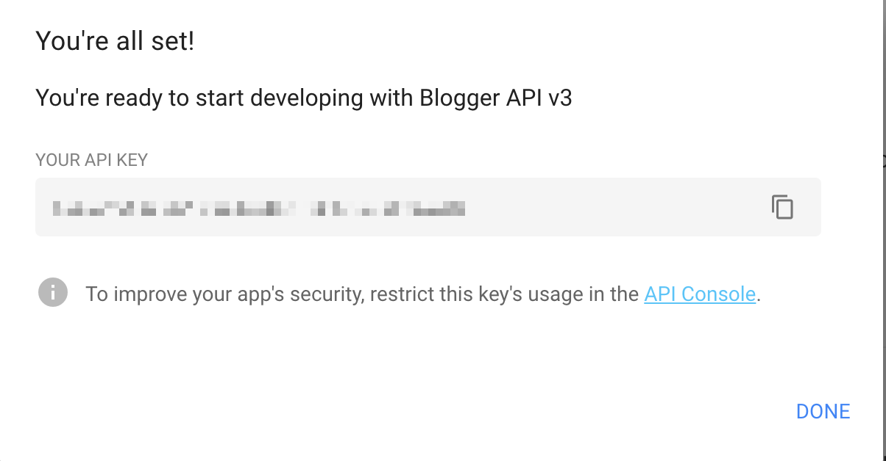
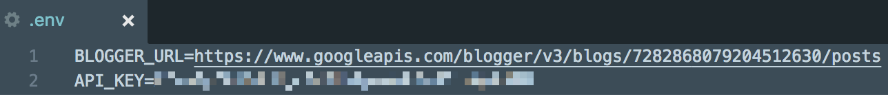

# Set up Google's Blogger API

Visit the [Blogger homepage](https://www.blogger.com/about/).

Create an account or sign in.

Create a blog you want to use with your application. The name and url don't really matter as you will be using the blog ID.

#### Grab the blogID from the url:

Now that the blog is set up, you need to create a key for the blog. This can be done [here](https://developers.google.com/blogger/docs/3.0/using#APIKey) under `Acquiring and using an API key`

Agree to terms and services.

Copy the key that it provides you:

And finally, set both the `BLOGGER_URL` and `API_KEY` respectively:

